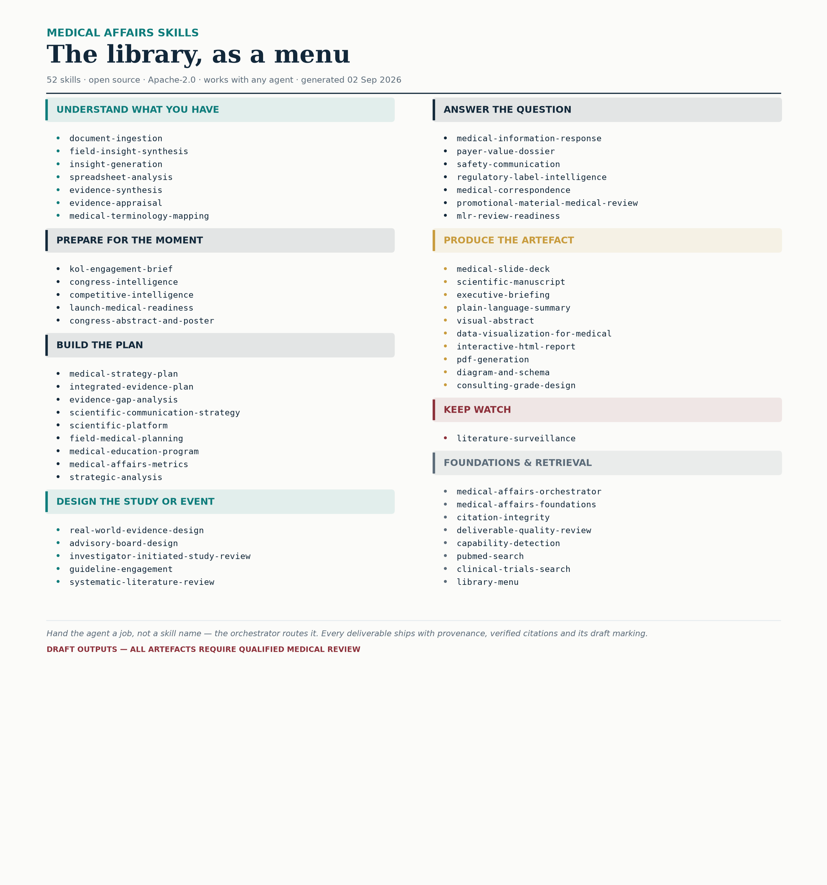

# Medical Affairs Agent Skills

**Give an AI agent a Medical Affairs job, not a prompt.**

An open library of **52 skills** that encode how experienced Medical Affairs
professionals actually work — so that an AI agent can be handed a job and
execute it to a standard that survives medical review, in deliverables that
look like they came from a top-tier advisory firm.



> 🤖 **If you are an AI agent reading this repository, go to
> [AGENTS.md](AGENTS.md).** That is your entry point — read it first, then
> [SKILLS-INDEX.md](SKILLS-INDEX.md) for the full catalogue.

---

## What this is for

Medical Affairs work has structure that generic AI assistance does not know
about. An agent asked to summarise field notes will produce themes, not
insights. Asked to build a medical plan, it produces a list of activities with
no strategy behind it. Asked for evidence, it will produce a beautifully
formatted citation to a paper that does not exist.

These skills encode the difference: what an observation has to do before it
counts as an insight, what a single-arm trial can and cannot support, why a
cross-trial comparison is not evidence, when an unapproved use may be discussed
and through which channel, and what has to be true before a deliverable is
allowed to leave the building.

**Works with any agent.** Skills are plain markdown with `SKILL.md` frontmatter.
Claude Code and Claude.ai discover them natively. Grok, ChatGPT, Copilot,
Cursor and others read `AGENTS.md` and orient from there.

---

## Quickstart

```bash
git clone https://github.com/Open-Medical-Affairs/Medical-Affairs-Skills.git
cd Medical-Affairs-Skills
```

Then point your agent at the repository and give it a job:

> *"Here are 50 field interaction records from the last quarter. Tell me what
> leadership should know."*

> *"I'm meeting Dr Okafor on Thursday about MRD-guided discontinuation. Prepare
> me."*

> *"The congress finished yesterday. Tell leadership what changed."*

> *"What evidence are we missing, and how should we spend £5m closing it?"*

You should see it announce the workflow, say what materials are missing before
it answers, run real literature searches, argue against its own conclusions, and
deliver with a provenance appendix.

### Claude Code

```bash
/plugin marketplace add Open-Medical-Affairs/Medical-Affairs-Skills
/plugin install medical-affairs-skills
```

### Grok and other agents that read AGENTS.md

Point the agent at this repository (clone it, upload it, or paste the URL if
the agent can fetch) and it will read `AGENTS.md` and orient itself. No
installation step. Give it a job, not a skill name.

---

## What's in it

| Tier | Skills |
|---|---|
| **Orchestrator** | Routes a job to the right workflow and runs the six-stage contract |
| **Foundation** | Compliance and safety boundaries (always loaded) · evidence appraisal · citation integrity · self-critique · capability detection |
| **Reasoning primitives** | Insight generation · evidence synthesis · strategic analysis |
| **Data and search** | PubMed · ClinicalTrials.gov · openFDA labels and FAERS · systematic review · terminology mapping |
| **Workflows** | KOL briefing · field insights and field planning · congress and competitive intelligence · publication strategy and scientific platform · medical planning · evidence gaps and integrated evidence plans · RWE design · medical information · payer and HTA dossiers · advisory boards · medical education · IIS review · guideline engagement · safety communication · launch readiness · promotional review · impact metrics · **literature surveillance · executive briefing** |
| **Content generation** | Slide decks · manuscripts · abstracts and posters · correspondence · plain language summaries · MLR readiness · clinical figures · visual abstracts · diagrams · spreadsheets · PDFs · interactive reports · document ingestion · **the shared consulting-grade design system · the library menu card** |

Full catalogue with dependencies: **[SKILLS-INDEX.md](SKILLS-INDEX.md)**

**Everything degrades rather than failing.** If python-pptx is not installed you
get the deck as markdown plus a build spec; if matplotlib is not there you get
hand-written SVG with the data table; if nothing is available you get the full
content in the response. The citations, study designs, denominators and safety
data survive every tier, and CI proves it by running the generators in an
environment with no document libraries installed at all.

---

## What the output looks like

[`examples/advisory-board-deck/`](examples/advisory-board-deck/) is a complete
**synthetic** exemplar: a 13-slide advisory board deck with a generated title
backdrop, four matplotlib charts (a Kaplan–Meier curve with numbers at risk, a
subgroup forest plot with the interaction p-value, paired adverse-event bars,
an evidence-maturity chart), banded tables, kicker lines carrying the study
design, citations on every data slide, and the draft marking on every page.

Rebuild it yourself:

```bash
pip install matplotlib python-pptx
python3 examples/advisory-board-deck/make_figures.py
python3 skills/medical-slide-deck/scripts/build_deck.py \
    --spec examples/advisory-board-deck/deck.json \
    --out  advisory-board.pptx
```

The look comes from **`consulting-grade-design`** — the library's shared
visual language. One ink, one accent, a reserved safety colour, message-first
titles, direct chart labels, generous white space. Every output skill applies
it, and every chart is rendered with real function calls into matplotlib —
never a description of a chart. All sample data is synthetic and says so.

---

## Three things that make it different

### It refuses to make up citations

Every reference is resolved against PubMed, CrossRef, OpenAlex or
ClinicalTrials.gov before it can appear in a deliverable. Unresolved identifiers
are removed, not caveated — an identifier that does not resolve is very likely
fabricated.

```bash
python3 skills/citation-integrity/scripts/verify_citations.py --file draft.md
```

### It knows what a study design can support

A single-arm trial result is what happened to those patients, not what the drug
does relative to anything. The library carries that discipline through
appraisal, synthesis, slides, manuscripts, and figures — the Kaplan–Meier
builder will not render a curve without a numbers-at-risk row, and the deck
builder will not render a data slide without a citation and a named design.

### It surfaces safety findings you did not ask about

Field notes are one of the highest-yield sources of unreported adverse events in
a pharmaceutical company, and the reports are never labelled as such. Every skill
that touches human-sourced text scans for them first and surfaces them verbatim,
before any analysis — while stating plainly that it is a detection aid and not a
control.

---

## Make it yours without forking

Every skill reads `house-rules/<skill-name>.md` before it produces anything.
Rules there **override** the defaults.

```markdown
## YOUR RULES — ADD BELOW THIS LINE

- Never cite congress abstracts in externally facing material.
- Two pages maximum for a KOL brief. Our MSLs read these in the car park.
- Every proposed activity must trace to a stated strategic priority.
```

That is the whole mechanism. Your SOPs, your terminology, your evidence
thresholds — encoded once, applied by every agent, and you still get upstream
improvements. See [house-rules/README.md](house-rules/README.md).

---

## The workshop

`workshop/` contains everything to run a hands-on session: a facilitator guide,
six team missions, a long-horizon Round 3 exercise, a judging scorecard, and
**entirely synthetic** data packs in three therapeutic areas (oncology,
immunology, cardiometabolic).

The arc is: give the agent a job → teach it something it did not know by editing
one house-rules file → give it an objective it has to plan for itself.

Start at [workshop/FACILITATOR-GUIDE.md](workshop/FACILITATOR-GUIDE.md).

---

## Before you use this on anything real

Read **[DISCLAIMER.md](DISCLAIMER.md)**. In short:

- Output is **draft material requiring qualified medical review**. The draft
  marking stays on until a reviewer removes it.
- This is **not** a medical device, clinical decision support, a validated GxP
  system, or a pharmacovigilance system.
- It **discharges no adverse event reporting obligation**. Your clock starts when
  the information reaches you.
- Use **synthetic, de-identified or aggregate data**. All sample data here is
  fictional.
- Where this conflicts with your organisation's SOPs, **your SOPs win** — record
  that in `house-rules/`.

---

## Contributing

The scarce input here is Medical Affairs expertise, not markdown. The most
valuable contribution is a concrete example of an agent reasoning badly, with
what an experienced colleague would have done instead.

See [CONTRIBUTING.md](CONTRIBUTING.md) and
[docs/authoring-skills.md](docs/authoring-skills.md).

```bash
pip install pyyaml
python3 scripts/build_index.py
python3 scripts/validate_skills.py
python3 scripts/selftest_apis.py
```

Added a skill? Regenerate the menu card so the README stays current:

```bash
python3 skills/library-menu/scripts/menu_card.py --out assets/menu-card.svg
```

---

## Licence and attribution

**Apache-2.0** — chosen because the explicit patent grant is what pharmaceutical
legal teams need in order to approve internal use.

Architectural debt to the MIT-licensed
[K-Dense-AI/scientific-agent-skills](https://github.com/K-Dense-AI/scientific-agent-skills)
project is recorded in [THIRD-PARTY-NOTICES.md](THIRD-PARTY-NOTICES.md), along
with a note on why that repository's `docx` and `pptx` skills were deliberately
excluded.

No licensed terminology (MedDRA, SNOMED CT, WHO Drug Dictionary) is redistributed
here.
